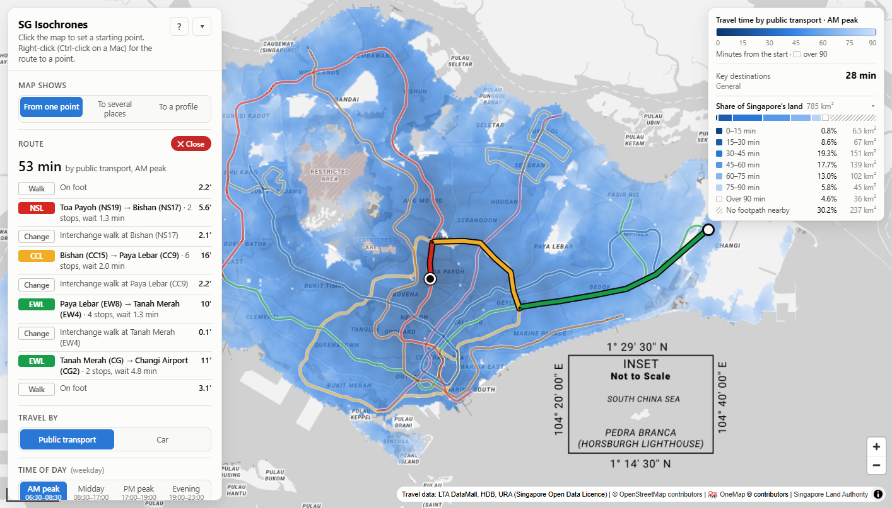

# SG Isochrones

Click anywhere in Singapore and see how long it takes to get everywhere else, as a
travel-time heatmap. Public transport covers walking, buses, MRT and LRT; a separate
car mode uses typical traffic for the time of day. Everything runs locally.



## Quick start

You need **Python 3.12, 3.13 or 3.14** and **[Poetry](https://python-poetry.org/docs/#installation)** 2.x.
One launcher, `run.sh`, works on macOS, Linux and Windows. On Windows it runs in Git Bash,
which comes with [Git for Windows](https://gitforwindows.org/).

| | Install the prerequisites |
|---|---|
| **macOS** | `brew install python@3.13 poetry` (or Python from python.org + `pipx install poetry`) |
| **Windows** | Python from [python.org](https://www.python.org/downloads/) or `winget install Python.Python.3.13`, then Poetry from Git Bash: `curl -sSL https://install.python-poetry.org \| py -` |
| **Linux** | Python from your package manager (or pyenv or uv), then `pipx install poetry` |

Then, from the project folder:

```bash
./run.sh                            # http://127.0.0.1:8000
./run.sh --port 8080 --no-browser
```

Press Ctrl-C or close the terminal window to stop the server.

On Windows, run it in Git Bash: the Git Bash app, or VS Code's Git Bash terminal (pick
*Git Bash* from the menu next to **+** in the terminal panel). From PowerShell, use
`& "C:\Program Files\Git\bin\bash.exe" run.sh`; a plain `bash` there may be WSL's.
Double-clicking `run.sh` also works where `.sh` files open with Git Bash (Git for
Windows' default, unless an editor has claimed the file type).

The first run takes a few minutes:

1. Poetry creates `.venv` in the project with the newest Python 3.12–3.14 it can find, and
   installs the locked dependencies from `poetry.lock`.
2. The networks are built (about a minute, including a ~40 MB OpenStreetMap download).
3. The app opens at http://127.0.0.1:8000.

Later runs start in a few seconds. The same steps with Poetry directly, on any OS:

```bash
poetry install                           # .venv + locked dependencies (incl. dev tools)
poetry run isochrone build               # networks -> data/build (gitignored)
poetry run isochrone serve --open        # http://127.0.0.1:8000
```

The map background loads tiles from OneMap (or Esri) over the internet; all routing is
computed locally. Resources needed: about 600 MB of disk (environment plus data), and
about 0.5 GB of RAM while building (the server uses about 0.25 GB).

### Troubleshooting

- **Poetry uses the wrong Python** when you run it directly (e.g. macOS's built-in
  `python3`, which is 3.9): run `poetry env use 3.13` once (a version or a path), then
  `poetry install`. The launcher does this for you, or takes `PYTHON=/path/to/python ./run.sh`.
- **Windows: `bash run.sh` in PowerShell stops with a WSL message**: with WSL installed,
  PowerShell's `bash` is WSL's Linux bash, which can't use this folder's Windows
  environment. Use Git Bash: `& "C:\Program Files\Git\bin\bash.exe" run.sh`.
- **Windows: `DLL load failed … The filename or extension is too long`**: the project
  sits in a folder whose path is too long for Windows' 260-character limit once `.venv`
  is added. Move it to a shorter path, or enable Windows long-path support.
- **Port already in use**: start on another port (`./run.sh --port 8080`, or
  `poetry run isochrone serve --port 8080`). On Windows, a server whose terminal was
  ended from Task Manager keeps running; end its `python.exe` there too.
- **Start again from scratch**: delete `.venv` and `data/build`, then run the launcher again.

## Using the app

- **Click** the map to set the start point (or drag the black pin). The heatmap shows the
  door-to-door travel time from there to every 50–250 m cell of land.
- **To several places** (under *Map shows*): click up to five places, such as workplaces,
  schools or family, or add them from the landmarks table. The heatmap then shows, for
  every spot, the average door-to-door time from there to the places: where to live or
  meet so the trips add up to the least. Hover for each place's own time; drag a numbered
  pin to move it. **Right-click** a spot (or use *Trips* in the landmarks table) to see
  its trip to each place, with legs, and their weighted average. They appear at the top
  of the panel; *✕ Close* or Esc removes them.
- **Weights and names**: give each place a name and a weight for how much it counts.
  Trips per week work well: for a couple, *Work (you)* 5, *Work (partner)* 5 and
  *Weekend park* 2, which is what *try an example* loads. The map shows the weighted
  average, each place's share of it is listed, and a weight of 0 leaves a place out.
  Weights apply instantly, with no new search.
- **Right-click** a point (**Ctrl-click** or two-finger click on a Mac), or use *Route* in the
  places table, to see the fastest itinerary there: walks, bus services, train lines,
  interchanges and waits. *✕ Close* or Esc removes it.
- **Travel by**: public transport (walk + bus + MRT/LRT) or car.
- **Time of day**: weekday AM peak (06:30–08:30), midday, PM peak (17:00–19:00) or
  evening (19:00–23:00). These match the headway bands LTA publishes for buses. Waits
  follow the band: trains run every 2–5 minutes at peak and 4–7 off-peak on most lines,
  and most buses run more often at peak too.
- **Waiting at stops**: *best case* (every bus and train turns up as you arrive),
  *average* (you arrive at a random time) or *worst case* (you just missed each one).
- **Walking speed** slider (3–6.5 km/h). Getting to MRT platforms and changing lines
  scale with it too (below).
- **Buses / MRT / HDB void-deck shortcuts** can each be switched off to compare.
- **Parking allowance** (car mode): 0, 2 or 5 minutes added at the destination.
- **Resolution**: low (250 m), medium (100 m) or high (50 m) grid cells.
- **Display**: a smooth ramp or bands. *Colour up to* (30–150 min) sets where colouring
  stops, in either style. *Band width* (5–30 min) only sets the step between bands, so
  15-minute bands up to 90 minutes gives six bands. If the cut-off isn't a multiple of
  the width, the last band is shorter.
- **Colours**: Blues (default), Viridis, Plasma, Yellow–orange–red, Yellow–green–blue,
  Blue–white–orange or Green–yellow–red (hard to read with red–green colour blindness),
  each reversible. One-way schemes start from their dark end in the light theme and their
  light end in the dark theme, so colour fades into the basemap with distance.
- **Opacity** and **overlays** for MRT/LRT lines, bus routes and bus stops. Hover for exact
  times, station names and the bus services on a road.
- **Key destinations**: the weighted average travel time from the start point to a
  profile's important places, shown in the legend card, with a breakdown in the panel by
  group and by place. Pick a **profile** in the panel; switching is instant (below).
- **Share of Singapore's land** (in the legend card): how much of the land falls in each
  band, as a bar and a table. The land is URA's outline, 785 km² including reservoirs and
  offshore islands. The last two rows are land beyond the cut-off, and land more than
  400 m from any footpath (forest, airfields, military and industrial islands), which
  the map leaves blank. Rows follow the bands, or the legend's steps in smooth mode.
- The **Reachable area** and **Travel time to places** tables give the same information
  as text. Settings, start point and map view are kept in the URL, so links can be shared.

### Key destination profiles

*General* is the sample list of the sibling *the-fastest-journey* project, copied
unchanged. The others are illustrations of different lives. Each sums to 100:

| Profile | Weights |
|---|---|
| General | work in the CBD 40% and in regional centres 20%, shopping and leisure 26.5%, nature 11.5%, Kranji (for Johor) and Changi Airport 2%: 36 MRT stations |
| Office job in the CBD | CBD offices 50%, food and drinks 15%, shopping and leisure 20%, parks and exercise 10%, the airport 5% |
| Office job outside the CBD | business parks and regional centres 50% (one-north, Jurong, Paya Lebar, Changi Business Park, Science Park and others), shopping and food 25%, parks 15%, meetings in the CBD 6%, the airport 4% |
| Industrial job | industrial estates 55%: Jurong and Tuas 26%; Sungei Kadut, Senoko, Woodlands and Seletar 12%; Loyang, Changi, Tampines, Kaki Bukit, Ang Mo Kio and others 17%. Heartland shopping and errands 28%, parks 12%, other 5% |
| Frequent trips to JB | crossings 40%: Woodlands Checkpoint 14, the RTS Link at Woodlands North 12 (due to open at the end of 2026), Tuas Checkpoint 6, Kranji and Queen Street buses 4 each. Work 40%, shopping 15%, the airport 5% |
| Sports and fitness | the Sports Hub and eight ActiveSG sports centres 30%, parks and the coast for running and cycling 35% (East Coast Park, MacRitchie, Bukit Timah and others), work 30%, other 5% |
| Student | universities 40% (NUS, NTU, SMU, SIT, SUSS and SUTD, roughly by enrolment), the five polytechnics 30%, malls 22%, parks 8% |
| Visitor | Marina Bay and the Civic District 30%, heritage districts and food 25%, shopping 15%, Sentosa, the Mandai wildlife parks and other attractions 25%, the airport 5% |

Places are MRT stations or, where no station fits (checkpoints, campuses, parks,
industrial estates), coordinates taken from OpenStreetMap. Edit
[`data/manual/key_destinations.toml`](data/manual/key_destinations.toml) to change the
weights or add a profile, then restart the server.

## How travel times are calculated

Each click runs one shortest-path search (Dijkstra) over a single graph, and the result
is sampled onto the grid.

**Walking** uses the real footpath and road network from OpenStreetMap (footways,
covered linkways, overhead bridges, steps and so on; expressways and private roads are
excluded). **HDB void decks**: HDB's building footprints are used to add a walking link
straight through each block wherever footpaths meet it on opposite sides (76,600 links,
from 13,447 building footprints). In estates this adds 3–12% to the area walkable within 15
minutes and saves up to about 6 minutes for some destinations.

**Buses** (777 service directions, 5,194 stops) come from LTA DataMall. Boarding costs a
wait taken from LTA's published dispatch-frequency range for the time band, e.g. "08-12"
minutes:

| Wait setting | Wait per boarding |
|---|---|
| Best case | 0 |
| Average | half the middle of the range (5 min for 08-12) |
| Worst case | the top of the range (12 min) |

These ranges are LTA's own timetable for each service and period, so buses already wait
less at peak: the median service runs every 9.5 minutes in the AM peak, 11.5 at midday,
10.5 in the PM peak and 13.5 in the evening, and 79% run more often in the AM peak than
at midday.

Stop-to-stop running times combine a physical model (20 s dwell plus a cruising speed
that rises from 22 km/h on short hops to 50 km/h on long expressway hops) with LTA's
scheduled arrival times at each stop. The schedules are rounded to the minute and
sometimes mix trips, so they only rescale the model locally where they agree with it.
Peak-band factors (×1.10 AM, ×1.12 PM, ×0.92 evening) cover traffic.

**Trains** use LTA's official GTFS timetable (on DataMall since August 2026) for a
reference weekday: 6,032 trips over 426 platforms. It sets running times and where and
when trains run, per track segment; riding through a station is only allowed along
platform sequences that real trips run.

**Stations**: getting between the street and a platform, either way, takes a time per
station, in [`data/manual/station_access.csv`](data/manual/station_access.csv). It covers
escalators, stairs, fare gates and corridors, is given at the default 4.8 km/h and scales
with walking speed:

| Stations | Street to platform |
|---|---|
| Elevated and at-grade stations, LRTs | 30 s |
| Other underground stations: North–South and East–West lines | 75 s |
| Other underground stations: North East and Circle lines | 90 s |
| Other underground stations: Downtown and Thomson–East Coast lines | 2 min |
| 31 stations with a published depth, from Novena (15 m) to Bencoolen (43 m) | 4 s per metre: 1–2.9 min |

No per-station timings are published, so the time comes from depth. Escalators run at
0.75 m/s at peak; up a 30° slope that is 2.7 s per metre of rise, and the walks between
flights bring it to about 4 s per metre. Depths come from the stations' Wikipedia
articles (which cite LTA and press figures); the defaults are the same rule at typical
depths (7.5 m up to an elevated platform, 19, 22 and 30 m down), and the published
depths of the other stations on each line fall around them. That time covers entrances
above the platform: those within 50 m of its centre plus the escalators' horizontal run.
From farther entrances, such as long underpasses or the far side of an interchange, the
extra distance is walked. Station exits are LTA's, from the timetable feed.

**Train waits** come from the operators' published frequencies for each line, or line
section, at peak and off-peak, in
[`data/manual/train_frequencies.csv`](data/manual/train_frequencies.csv). They're treated
like the bus ranges above:

| Line | Peak | Off-peak | Peak wait, average / worst | Off-peak wait |
|---|---|---|---|---|
| North–South, East–West | every 2–3 min | 4–5 min | 1.25 / 3 min | 2.25 / 5 min |
| North East | 2–4 | 5–6 | 1.5 / 4 | 2.75 / 6 |
| Downtown, Sengkang and Punggol LRT | 3–4 | 5–6 | 1.75 / 4 | 2.75 / 6 |
| Circle | 3–5 | 5–7 | 2 / 5 | 3 / 7 |
| Thomson–East Coast | 3–5 | 5–6 | 2 / 5 | 2.75 / 6 |
| Changi Airport branch | 7–12 | 7–12 | 4.75 / 12 | 4.75 / 12 |

The NSL north of Yishun (2–5 min at peak) and the EWL beyond Joo Koon (4–6 at peak, 8–10
off-peak) have their own rows. The AM and PM peak bands take peak frequencies; midday and
evening take off-peak ones. The Bukit Panjang LRT publishes no frequencies, so its waits
come from the timetable's gaps. Those gaps are also what the other lines used before:
they understated the peak, as the AM band opens with an hour of shoulder service, and
their longest gap, the worst case, came to about 5 minutes in every band.

The feed (version 0.1) gives running times in whole minutes plus a flat 40 s dwell, which
overstates journeys: it schedules 103 minutes for the full East–West Line, against the
~80 minutes usually quoted. In-train times are therefore scaled per line by factors
fitted against the mrt.sg station-to-station matrix: EWL 0.77, NSL 0.94, NEL 0.78, CCL
0.80, DTL 0.76, TEL 0.85, and LRTs 1.0 (no reference data). They're in
`RAIL_RUNTIME_FACTOR` in `isochrone/config.py`; set them to 1.0 to use the raw timetable.

**Interchanges** use the Reddit-measured leisurely walking times in
[`data/manual/mrt_transfer_times.csv`](data/manual/mrt_transfer_times.csv), scaled by
`4.0 km/h ÷ your walking speed`. At the default 4.8 km/h a 200 s leisurely transfer
takes 167 s. They're matched by station code, falling back to name and line for the
renumbered Bayfront and Marina Bay (CE1/CE2 are now CC34/CC33). Interchanges not in the
file default to 180 s, or 60 s for switching platforms on the same line.

**Driving** uses OpenStreetMap roads with one-way rules. Speeds depend on road class and
time band, with peaks calibrated to LTA's measured peak-hour averages: 55 km/h on
expressways and 29 km/h on arterial roads in 2025
([`data/raw/lta/average_peak_speeds.csv`](data/raw/lta/average_peak_speeds.csv)). The
start and destination are joined to the nearest road on foot.

**Several places**: trips *to* a place aren't the reverse of trips from it (one-way
roads and bus loops, and waits at the boarding stop rather than the last one), so each
place gets one search over the reversed graph: every edge flipped, with
the same weights. That gives every spot's time to the place directly, and it matches the
router's forward itinerary to within grid rounding. The browser averages the places' grids
cell by cell, so a new place costs one search (about 0.2 s) and weights apply instantly.

**The grid**: each cell takes the fastest of its four nearest network nodes plus the
remaining walk (straight line × 1.2). Cells more than 400 m from any footpath (forest
interiors, runways, military areas) are left blank. Resolution barely affects speed: a
new search takes about 0.1 s, and sampling it takes 5–40 ms. Changing resolution, the
parking allowance or the colour scale reuses the last search.

### Validation

`scripts/validate_mrt.py` compares modelled station-to-station times with an external
matrix, such as the mrt.sg matrix used in the sibling *the-fastest-journey* project. The
fitting behind the rail factors above shows mrt.sg's times follow "about 4 minutes plus a
per-stop time", so the comparison has two parts:

| Comparison (20,306 station pairs) | Raw timetable | Calibrated |
|---|---|---|
| Per-stop in-train time vs mrt.sg (EWL/NEL/DTL) | 1.28–1.32× | ≈1.0× (fitted) |
| Platform-to-platform time with average waits, median difference | +0.2 min | −5.4 min |

The calibrated median sits below mrt.sg by about that fixed ~4-minute allowance, which
the model replaces with its own waits and transfer walks. Door-to-door spot checks from
Raffles Place, with average waits:

| To | AM peak | Midday |
|---|---|---|
| Jurong East | 28 | 29 |
| Tampines | 32 | 33 |
| Changi Airport | 42 | 43 |
| Woodlands | 49 | 51 |
| Tuas Link | 52 | 53 |

These are in line with typical journey-planner times. The development commands below
reproduce these checks.

## Data sources and freshness

| Data | Source | As of |
|---|---|---|
| Bus stops, services, routes, headways | LTA DataMall | fetched 26 Sep 2026 |
| MRT/LRT timetable, platforms, station exits | LTA DataMall GTFS Schedule (Train) | published 26 Sep 2026; service day Mon 28 Sep 2026 |
| MRT/LRT peak and off-peak frequencies | Operators' figures as listed on SGWiki; LTA's network-wide figures | Sep 2026 |
| MRT station depths | Stations' Wikipedia articles (LTA and press figures) | Sep 2026 |
| Footpaths and roads | OpenStreetMap (openstreetmap.fr extract) | 25 Sep 2026 |
| MRT/LRT line shapes (overlay) | OpenStreetMap route relations | 25 Sep 2026 |
| HDB building footprints | HDB via data.gov.sg | fetched 26 Sep 2026 |
| Singapore land outline | URA Master Plan 2019 region boundary (no sea) | 2019 |
| Peak-hour road speeds | LTA via data.gov.sg | to 2025 |
| Bus route lines (overlay) | [busrouter.sg](https://busrouter.sg) mirror of LTA data | 1 Sep 2026 |

The train timetable reflects the network open today, including Circle Line Stage 6
(Keppel, Cantonment, Prince Edward Road). Stations not yet in LTA's timetable, such as
the TEL Stage 5 and DTL extension stations, aren't included.

**Small datasets are committed** under `data/raw` (about 10 MB). The OSM extract, raw HDB
GeoJSON and built networks live in the gitignored `data/cache` and `data/build`.

### Refreshing the data

LTA DataMall needs a free account key ([datamall.lta.gov.sg](https://datamall.lta.gov.sg)).
Put it in a `.env` file in the project root (gitignored):

```
LTA_ACCOUNT_KEY=your-key
```

Then:

```bash
poetry run isochrone fetch                          # all sources
poetry run isochrone fetch --only osm --force       # just a newer OSM extract
poetry run isochrone build                          # rebuild networks (~1 min)
```

Sources: `lta`, `speeds`, `osm`, `hdb`, `boundary`, `busrouter`. Only `lta` needs the key.
Each fetch records its time and licence in `data/raw/sources.json`. The build uses today's
date, or the next weekday, as the timetable service day.

## Project layout

```
isochrone/
  config.py      model constants: bands, speeds, waits, grid sizes, data sources
  fetch.py       downloaders (LTA DataMall, OSM, data.gov.sg, busrouter)
  osm.py         OSM -> walk and drive graphs
  transit.py     bus and train service models
  build.py       assembles networks, void-deck links, grids and overlays -> data/build
  engine.py      per-request edge weights, Dijkstra, grid sampling, itineraries
  server.py      FastAPI app (API + static front end)
web/             index.html, app.js, palettes.js (colour schemes), style.css,
                 vendored MapLibre GL JS 5.24
data/raw/        cached public datasets (committed)
data/manual/     hand-curated inputs (MRT interchange timings, train frequencies, station
                 depths, key destination profiles)
scripts/         probe.py, validate_mrt.py, screenshot.py (dev tools)
tests/           pytest suite
pyproject.toml   dependencies (Poetry); poetry.lock pins them for every platform
run.sh           launcher for macOS, Linux and Windows (Git Bash)
```

Tunable assumptions (speeds, dwell and access times, band factors, grid sizes) are all in
`isochrone/config.py`.

## Development

```bash
poetry run pytest                                     # 48 unit + integration tests
poetry run python scripts/probe.py "Jurong East MRT"  # times to well-known places from an origin
poetry run python scripts/validate_mrt.py ../the-fastest-journey/mrt_distance/data/travel_times_final_20250706.csv
poetry run python scripts/screenshot.py "http://127.0.0.1:8000/#o=1.334,103.849" shot.png   # needs Edge/Chrome
```

The integration tests and scripts need a built network (`poetry run isochrone build`).
`poetry add <package>` updates `pyproject.toml` and `poetry.lock` together; commit both.

## API

| Endpoint | Parameters |
|---|---|
| `GET /api/isochrone` | `lat`, `lon`, `mode` (`transit`/`car`), `band` (`am_peak`/`midday`/`pm_peak`/`evening`), `wait` (`best`/`avg`/`worst`), `walk_kmh`, `res` (`low`/`med`/`high`), `bus`, `rail`, `voiddeck`, `parking`, `direction` (`from` the point, the default, or `to` it from everywhere). Returns the grid as base64 little-endian uint16 in tenths of a minute (65535 = no data, 65534 = not reached within 180 min), its `land_cells` (cells of land in the grid's footprint, mapped or not), reachable areas, and `key_destinations` (for each profile: each place's time, group averages and the weighted average). |
| `GET /api/route` | Same as above plus `to_lat`, `to_lon`. Returns itinerary legs with times and geometry. |
| `GET /api/meta` | Bands, options, data sources and build statistics. |
| `GET /api/overlays/{mrt_lines,mrt_stations,bus_routes,bus_stops}` | GeoJSON. |

## Limitations

- **Typical, not live**: no real-time bus arrivals, train disruptions or live traffic.
  Weekdays only.
- **One bus service per boarding**: at a stop served by several services going your way,
  real passengers take whichever comes first; the model waits for the best single
  service, so busy corridors can look slightly slower than they are.
- **Published, not timetabled, train waits**: train waits use each line's published
  frequency range rather than the timetable's own gaps, and both peak bands take peak
  frequencies throughout, though the operators' peaks start and end half an hour later
  (07:30–09:30, 17:30–19:30). The frequencies are as listed on SGWiki; the operators'
  own pages weren't checked.
- **Modelled, not measured, station times**: street-to-platform times follow from
  published depths for 31 stations and from a default by line for the rest. Escalator
  rides scale with walking speed along with the walks, and queues at escalators after a
  crowded train aren't modelled.
- **Timetable quirks**: LTA's timetable (v0.1) starts every train at a terminus, so trips
  are grouped into time bands by departure from the terminus (which decides where trains
  run in each band, and the Bukit Panjang LRT's waits). Its whole-minute running times are
  corrected with per-line factors (above), which will need revisiting when LTA publishes
  a finer-grained feed.
- **Excluded services**: bus services with no published headways (20 directions, mostly
  short workings such as 7A and a few City Direct runs), the Malaysian end of cross-border
  buses, ferries, Sentosa Express and the Changi Airport Skytrain.
- **Drawn geometry**: train legs in the route view are straight lines between stations,
  and bus legs are drawn stop to stop.
- **Basemap quirk**: OneMap draws a Pedra Branca inset box in the sea at low zoom. The
  Esri grey basemap avoids it and puts place names above the heatmap.

## Licences and attribution

Contains information from LTA DataMall, HDB and URA, accessed via data.gov.sg under the
[Singapore Open Data Licence v1.0](https://data.gov.sg/open-data-licence). Map data ©
OpenStreetMap contributors, available under the
[ODbL](https://www.openstreetmap.org/copyright). Basemap © OneMap / Singapore Land
Authority, or © Esri. Bus route lines are from
[cheeaun/sgbusdata](https://github.com/cheeaun/sgbusdata). MapLibre GL JS is BSD-3-Clause
licensed (`web/vendor/maplibre-gl/LICENSE.txt`). The Viridis and Plasma colour schemes
come from matplotlib (CC0); the ColorBrewer schemes are © Cynthia Brewer, Mark Harrower
and The Pennsylvania State University (Apache-2.0). The MRT interchange timings are
community-measured (Reddit).
